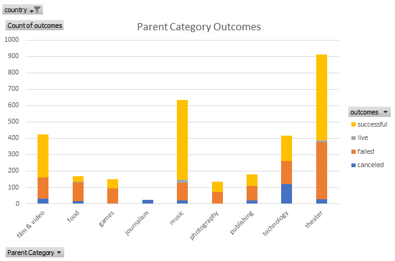
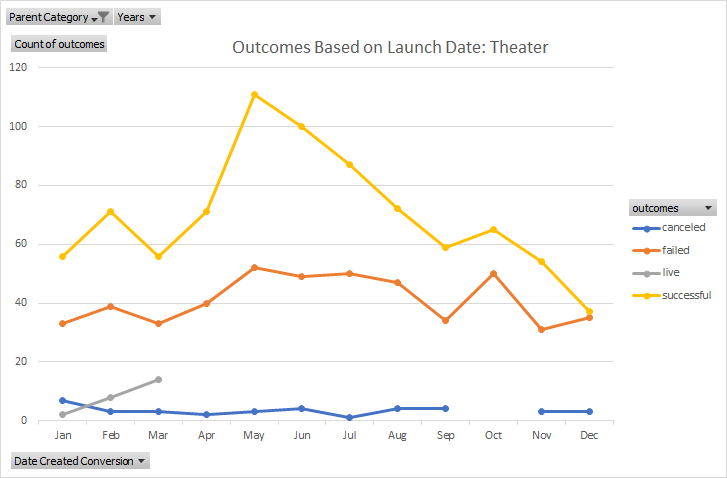

# An Analysis of Kickstarter Campaigns
This is an analysis of Kickstarter campaigns with a particular focus on theater projects in the United States and Great Britain. The purpose of this analysis is to uncover trends that may suggest successful campaign strategies that a playwrite can employ in her future Kickstarter campaigns aimed at funding two plays, one in the United States and one in Great Britain, each with different anticipated budgets.
## Outcomes Based on Variables
The data suggests that a campaign's success may be affected by the type of campaign, date of the campaign launch, and the size of the budget.

Figure 1

Figure 2

Figure 3

Figure 4

### Challenge

Figure 1: This data shows the volume of campaigns in each parent category, and the volume of each campaign outcome within those categories.
Figure 2: This data represents the trends of each outcome based on the campaign's goal.
Figure 3: This data represents the rate of each campaign outcome based on the launch date for all campaign types.
Figure 4: This data represents the rate of each campaign outcome based on the launch date for only theater campaigns.

Figure 1 suggests

Figure 2 suggests

In Figures 3 and 4, both graphs show that the highest volume of successful campaigns were launched in May, while the lowest volume of successful campaigns were launched in December. One possible reason for why there are more successful campaign's in May versus December could be that there are more campaigns overall in May, which could mean that the time of year may affect the overall volume of campaigns but not necessarily the success rate. To determine the relationship between a campaign's chance to succeed and its launch date, it would be more prudent to create a chart plotting the launch date against the percentage of successful campaigns, not the volume of successful campaigns.

With figures that show the relationship between the launch date and the volume of campaigns, such as Figures 3 and 4, we can still make determinations about how the launch date might affect the success rate. One way to evaluate Figures 3 and 4 to determine if the time of year is affecting the success rate would be to compare the volume of failures with the volume of successes. If they change in the same direction at the same rate throughout the year, then the time of year is more likely affecting the volume of campaigns rather than a campaign's chances of succeeding. If the volumes of successes and failures change at different rates and/or in different directions throughout the year, then that suggests that the chance of launching a successful campaign is, in fact, affected by when the campaign is launched.

To determine that the success rate in May truly is higher than other months, we can compare it to another month with a similar failure volume: October. May's success volume is significantly higher then October's, even though their failure volume is the same, suggesting that May's success rate is due to the time of year rather than the overall volume of campaigns. We can determine that December's success rate is due to the time of year because while the success volume decreases, the failure volume increases.

Based on Figures 3 and 4, campaigns are most likely to succeed if launched in May and least likely to succeed if launched in December, though we would need to create additional figures to determine how much more successful May campaigns are and how the other months relate, in the even that the playwrite does not want to wait until May.
